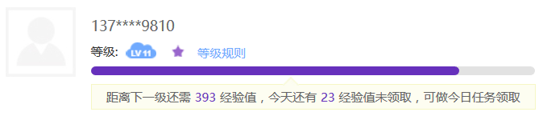
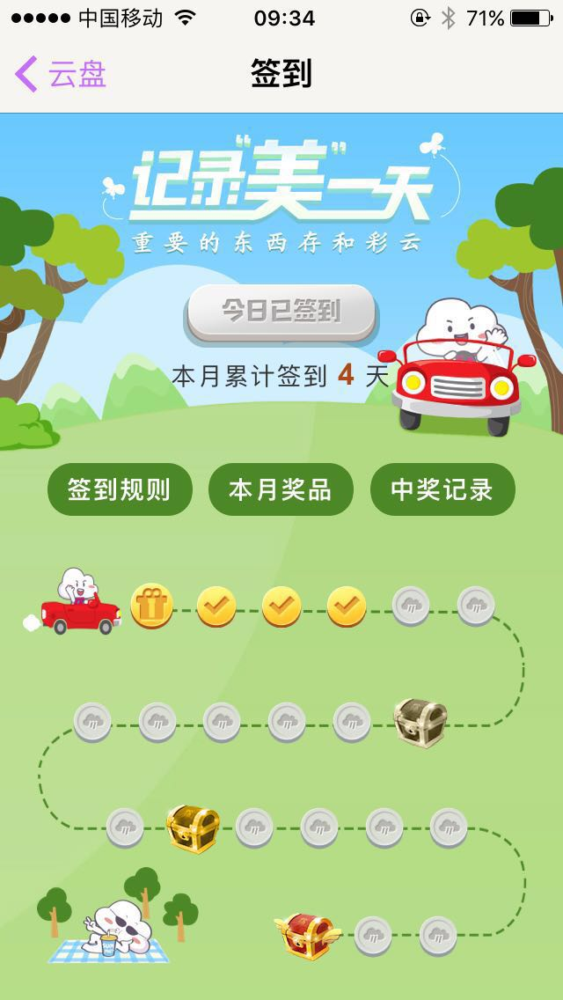

# 数据收集激励计划
---

<!-- toc -->

## 积分等级制
---

* 根据用户提交数据的活跃度计算积分。
* 积分用于折算用户活跃度等级。
* 不同的活跃度等级享有不同的福利。

### 总活跃度
---

> 总活跃度通过用户活跃度等级和总积分体现。 
用户可以通过完成签到、日常任务、活动任务等方式获取积分。

### 等级特权
---

|等级特权|等级|说明|
|----|----|----|
|日常完成的任务积分增加11%|lv11|积分加成与等级正相关|

### 日常任务
---

#### 签到

> 签到反应了用户打开小程序的活跃度。每月签到完成一定次数可以给予一定的奖励。

#### 数据提交

    * 饮食计划
    * 运动计划
    * 排便数据
    * 睡眠数据
    * 生理生化数据

|任务描述|完成获得积分|完成状态|
|----|----|----|
|步行达到10000步|10|已完成|
|10点入睡|5|未完成|
|7点起床|5|未完成|
|喝水1L|10|未完成|
|水果摄入达到500g|10|未完成|
|蛋白质摄入达到500g|10|未完成|
|蔬菜摄入达到500g|10|未完成|
|完成1次排便|10|未完成|
|提交一次体重数据|10|未完成|
|提交一次心率数据|10|未完成|
|提交一次血压数据|10|未完成|
|提交一次血常规数据|50|未完成|

#### 抽奖

> 用户完成了所有日常任务和一定的签到次数可以获得抽奖机会。抽奖可能获取大量积分奖励。 

### 活动任务
---

暂无
