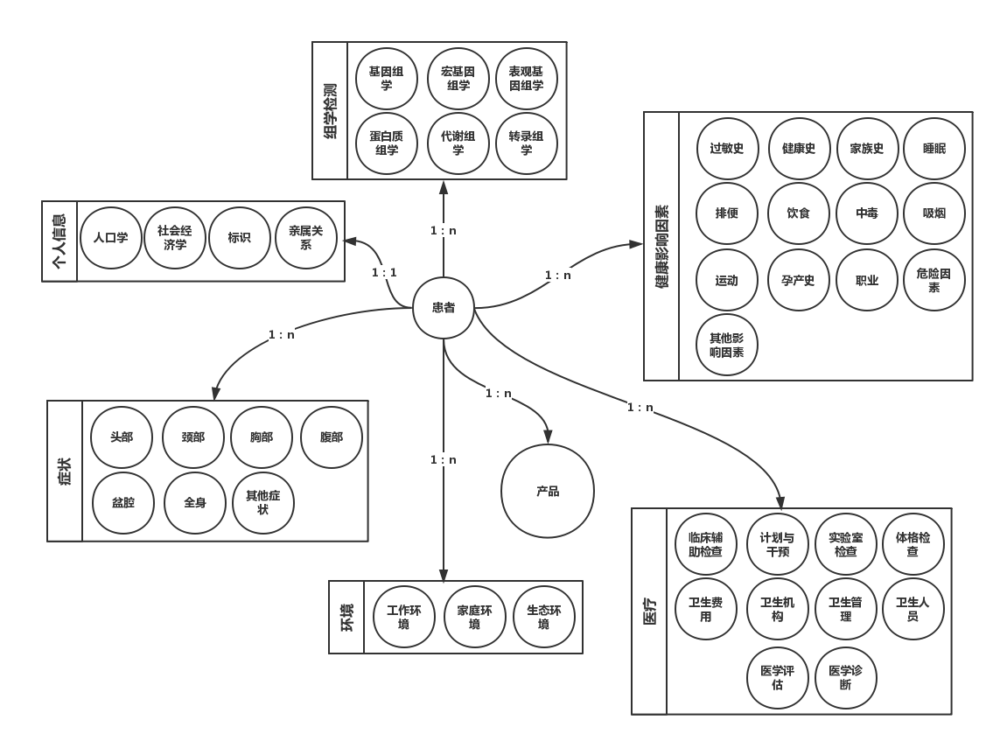
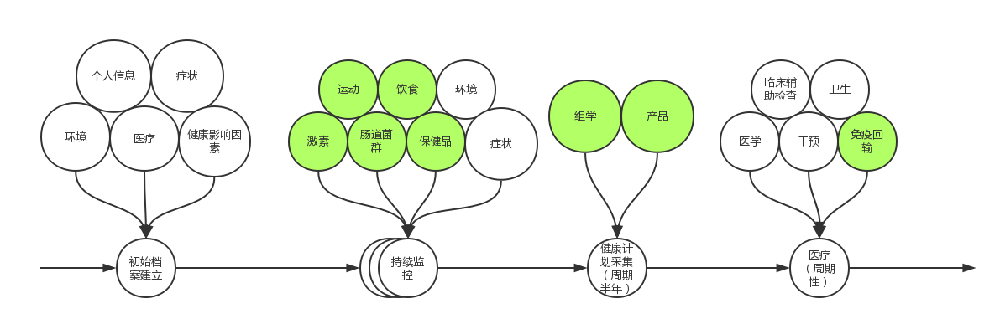

# 支撑与运营规划
---

<!-- toc -->

# 目标
---

> 设计一个科学的、完备的数据模型，通过社区化运作采集收录华大员工及其亲属中肿瘤患者的健康数据，来给每个患者建立健康管理的电子档案。通过运动、饮食、激素、免疫调节等干涉手段和对患者健康档案的动态监控，让患者可以明显的感知身体到是否康复、干预是否有效，同时可以为专家组和医生提供医疗辅助。

# 社区化运营
---

> 初期采用微信公众号+华大医学论坛+小程序的模式。

## 微信公众号
---
* 服务号名称：华大员工肿瘤关爱计划
* 微信号：BGIccp
* 账号主体：深圳华大基因研究院
* 功能：
    * 资讯推送
    * FAQ查询
    * 论坛跳转
    * 小程序跳转

## 论坛
---

论坛地址：http://bbs.bgidx.cn/forum.php

## 小程序
---

所有患者电子健康档案数据的录入接口和存储地。

# 数据库建立
---

## 健康档案数据模型
---

> https://www.processon.com/view/link/591e3f13e4b0ec8d9d803edb

### 个人信息

#### 标识

包含患者的唯一ID、使用华大产品的登记ID、医院病历号、住院号等等标识符。

#### 人口学
包含患者在人口学范畴的信息，如姓名、出生地、民族、父亲姓名等。

#### 社会经济学
包含患者在社会经济学范畴的信息，如电话号码、地理位置、医保编号等。
#### 亲属关系
包含患者与员工的关系、是否有子女等。
### 症状
#### 头部
如耳聋、呕吐等。
#### 颈部
如咳嗽、咽痛等。
#### 胸部
如心悸、胸闷等。
#### 腹部
如腹痛、腹泻、腹胀等。
#### 盆腔
如尿急、便秘等。
#### 全身
如关节痛、盗汗、恶心等。
#### 其他症状
如胎动、疫苗异常反应等。
### 医疗
#### 临床辅助检查
如血常规、B超、CT等。
#### 计划与干预
包含医疗计划和治疗方法等。如用药时间等。
#### 实验室检查
如HBV分型、癌胚抗原定量等。
#### 体格检查
如身高、体重、视力等。
#### 卫生费用
包含医疗费用记录。
#### 卫生机构
包含医疗机构的信息，如机构名称等。
#### 卫生管理
包含卫生事件的记录、监测等信息，如卫生事件名称、卫生事件发生地点等。
#### 卫生人员
包含卫生人员的信息，如卫生监督证/卡号码等。
#### 医学评估
包含医学的评估指标，如复发标识、复发次数、复发日期等。
#### 医学诊断
包含医学的诊断信息，如疾病诊断、临床诊断描述等。
### 环境
#### 工作环境
包含患者工作的环境信息，如从事职业工种、放射工龄（年）等。
#### 家庭环境
包含患者所在家庭的环境信息，如家庭厨房排风、厕所类别等。
#### 生态环境
如PM2.5、地标PH值等。
### 健康影响因素
#### 过敏史
#### 健康史
如既往病史、避孕史、出生缺陷等。
#### 家族史
#### 运动
#### 饮食
#### 睡眠
#### 排便
#### 吸烟
#### 中毒
#### 孕产史
#### 职业
包含每日工作时长、职业病等相关信息。
#### 其他影响因素
如近亲婚配、犯罪行为等事件。
### 组学检测
#### 基因组学
#### 转录组学
#### 宏基因组学
#### 表观基因组学
#### 代谢组学
#### 蛋白质组学
### 产品
来自患者使用华大检测产品（氨基酸、微量元素和重金属等）产生的数据，由公司内部提取，无需患者提供。

## 健康档案数据时光轴
---

> http://www.processon.com/view/link/591e4198e4b0b33567a5a5df

患者的健康档案数据有2个阶段：
### 初始档案建立
通过小程序向患者采集一份比较齐全的基线数据。基线包含患者的个人信息、症状、环境、医疗和健康影响因素方面的数据。
### 动态监控
* 持续监控

包含运动、饮食、睡眠、排便等日常行为监控及激素调节、肠道菌群调节、保健品调节等数据。

* 周期性的健康计划

半年一次采集数据，包含组学检测和应用于肿瘤的华大产品检测。
* 周期性的医疗

周期性的医疗数据，包含术后的放化疗治疗、靶向药治疗、临床辅助检查、卫生相关数据。
